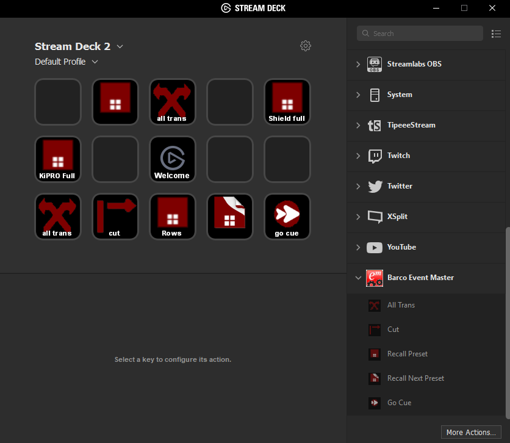

# Description

`Barco Event Master` is a plugin that supports communication with Barco Event Master Products;
- allTrans
- cut
- activateNextPreset
- activatePreset
- activateCue

# Features

- code written in Javascript
- cross-platform (macOS, Windows)
- automatic system network connection status

# Installation

In the Release folder, you can find the file `com.barco.eventMaster.SDPlugin`. If you double-click this file on your machine, Stream Deck will install the plugin.

##  Source code

The Sources folder contains the source code of the plugin.
